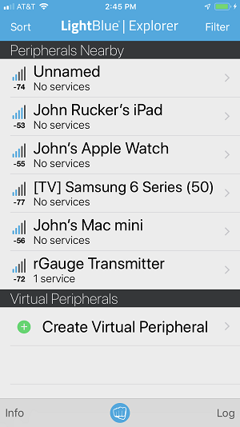
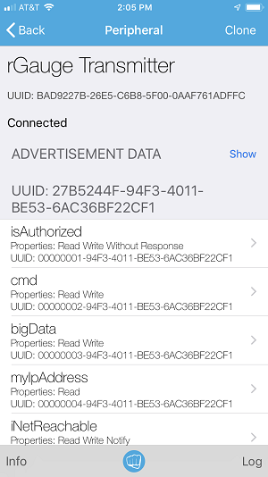
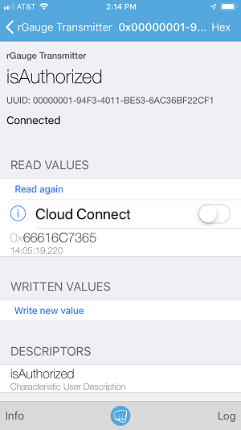
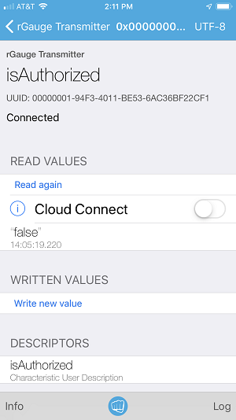
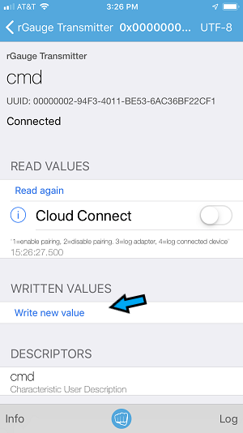
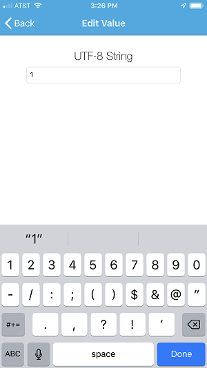
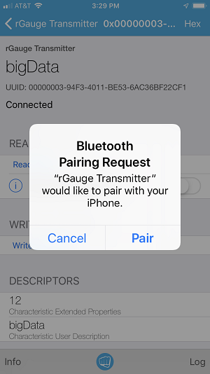

# blePeripheral
This is a Node.js class for creating a Bluetooth LE (Low Energy) peripheral based on Bluez 5.50 and its D-Bus based API.  This class supports secure encrypted connections to IOS introduced in Bluetooth 4.2 as LE Secure connections. If you want to securely connect your IOS device (Android should also work) to your Raspberry Pi with Bluetooth LE you must implement this level of security or IOS will not allow the device to pair and be bound. Here is a quote from Kai Ren in his [Bluetooth blog:]( https://blog.bluetooth.com/bluetooth-pairing-part-4) 
>Other than LE Legacy pairing, LE Secure Connections is the other option for pairing. LE Secure Connections is an enhanced security feature introduced in Bluetooth v4.2. It uses a Federal Information Processing Standards (FIPS) compliant algorithm called Elliptic Curve Diffie Hellman (ECDH) for key generation. For LE Secure Connections, it support four association models:
>* Just Works
>* Numeric Comparison (Only for LE Secure Connections)
>* Passkey Entry
>* Out of Band (OOB)
>
>Numeric Comparison only exists for LE Secure Connections, not for Legacy pairing. 

## Hardware Requirements
* Raspberry Pi Zero W
* iPhone or iPad with [LightBlue Explorer]( https://itunes.apple.com/us/app/lightblue-explorer/id557428110?mt=8) app.

This class was developed based on the Raspberry Pi Zero W’s built in bluetooth radio.  Other Raspberry Pi models may work but only the Pi Zero W has been tested.  
To properly test this class, you will need an IOS device with the BLE development tool [LightBlue Explorer]( https://itunes.apple.com/us/app/lightblue-explorer/id557428110?mt=8).  I have tested it with an iPhone 7 and iPad pro.  It should also work with an Android device I just haven't tested it.  There is a [LightBlue install](https://play.google.com/store/apps/details?id=com.punchthrough.lightblueexplorer&hl=en_US) on the Google Play store.  If someone can give this a try and document the results I will be happy to include a link to their site.  
## Software Requirements
This class requires blueZ version 5.50 (blueZ is the bluetooth daemon for debian linux) on top of Raspbian Stretch Lite.  The bluetooth version included in Raspbian Stretch Lite (blueZ 5.43) is old and does not support Bluetooth 4.2 secure connections to an IOS device.  To setup the software for Raspberry Pi Zero W follow the instructions here [Raspberry Pi Zero W Bluez V5.50 upgrades steps.](https://github.com/RuckerGauge/Raspberry-Pi-Zero-W-Bluez-5.50-upgrade-steps) 
 
 If you don't care about securely bonding to an IOS device, you can run this class on the generic Raspbian Stretch Lite install.  To do this you have to enable the -e experimental flag on the ExecStart line in /lib/systemd/system/bluetooth.service.  This class uses the advertising-API over D-Bus and that is only available in BlueZ 5.43 if running in experimental mode.  This is not the case in BlueZ 5.50 as the Advertising-API is fully supported.  

# Install and load sampleApp
on the Raspberry Pi Zero W from a [SSH session](https://www.raspberrypi.org/magpi/ssh-remote-control-raspberry-pi/):
* Type `git clone https://github.com/RuckerGauge/blePeripheral.git`
* Type `cd blePeripheral && npm install`
* Type `sudo cp netConfig.conf /etc/dbus-1/system.d`  This gives our sample app permission to bring up a service on the system D-Bus.
* Type `sudo node sampleApp` 
---
At this point you should have a Bluetooth LE (BLE) peripheral up and running on your Raspberry Pi Zero W.  The sample app sets up several test characteristics you can connect to for testing.  It also starts advertising as a BLE service so a bluetooth central (your iPhone) can find and connect to it.   The next step is to connect to this peripheral from an IOS device.  

# Test with iPhone
* Install the [LightBlue Explorer]( https://itunes.apple.com/us/app/lightblue-explorer/id557428110?mt=8) app on your iPhone or iPad and open it.
* The Peripherals Nearby list should have your device as you named it in the main.conf.  If you followed my [bluetooth 5.50 install steps](https://github.com/RuckerGauge/Raspberry-Pi-Zero-W-Bluez-5.50-upgrade-steps) the name will be **rGauge Transmitter**. Tap on that device to open and connect to the Raspberry Pi Zero W peripheral. You should see the following screens:

     
* You will see five characteristics labeled isAuthorized, cmd, bigData, myIpAddress and iNetReachable.  The first two can be accessed without binding to the Raspberry Pi as they have normal Read and Write flags set.  However, the last three (bigData, myIpAddress, iNetReachable) require that you pair with your iPhone before you can access their data.  Their characteristics are flagged as encrypt-read and encrypt-write.  So for now do not tap on them we will stay focused on the first two.

* Tap on the isAuthorized characteristic to open and read its value.  You will see a hex value that doesn’t make much sense.  It is hex encoded ASCII characters and to decode it you can tap on the word hex in upper right side of the screen.  Select the UTF-8 String from the list of options and you will see that the value is the word “false”.  This characteristic can be used to tell your IOS app if this device is bound or not with this peripheral.  It will change to “true” when we pair the iPhone to the device. 

     
*  A word about pairing with the iPhone.  To trigger the pairing / bonding process your iPhone needs to try and read a secure characteristic.  The iPhone will be denied access to the characteristic and sent an Insufficient Encryption error.  The iPhone in turn will try to pair with the peripheral by sending its capabilities that layout the type of connection it will accept.  This process is taken care of for us by the bluetooth daemon.  Our app doesn’t have to do anything other than tell the bluetooth radio it is allowed to pair.  By default, I have pairing disabled so if you tap on one of these secure characteristics you will not be prompted to pair because it is not allowed. It will act like it is reading the value but nothing is returned.  More on that later…
You can monitor the pairing process by opening another SSH connection to your Raspberry Pi Zero W and type `suod btmon`.  This is one of the best tools for troubleshooting connection problems.  When an iPhone pairs with your peripheral for the first time it exchanges several encryption keys, and stores them on the Raspberry Pi so it won’t have to do this again.  This is called bonding (it is possible to pair with a device and not bond to it. However, the iPhone requires a device to be bound).  Once you successfully pair with a peripheral your iPhone is also bound to it and ready to encrypt and de-encrypt data as it is transmitted and received over the bluetooth radio.

     
* To trigger the pairing process normally a user would push a button on their Raspberry Pi.  But for testing purposes I have setup a special characteristic that you can use to simulate a button push.  That is what the cmd characteristic does. To Open your peripheral for pairing select the cmd characteristic and convert the encoding from hex to UTF-8.  When you do that you will see the value of the data read is a menu of options **1=enable pairing, 2=disable pairing. 3=log adapter, 4=log connected device**.  We want to enable pairing so tap on the “Write new value” text and type the number 1 on your iPhone’s keyboard and then done. Now your peripheral is accepting pairing request and to start that process you need to access a secure characteristic.  Back up one screen (swipe right) and tap on the bigData characteristic.  A Bluetooth Pairing Request will pop up and you can hit Pair to complete the process.  From now on your phone will be bound to your Raspberry Pi Zero W bluetooth radio.  You will not have to go through this process again.

    
--- 
That’s it, your bound to your iPhone and off and running.  However, there is one [big bug I’m currently working on](https://github.com/RuckerGauge/blePeripheral/issues/1).  If you restart your raspberry Pi after bonding with an iPhone it will not be able to communicate whit the phone once the phone’s bluetooth address changes.  To work around this type `sudo systemctl restart bluetooth` after your Pi has booted back up.  Then restart your node app and your iPhone will be able to connect as a bound device.  
 